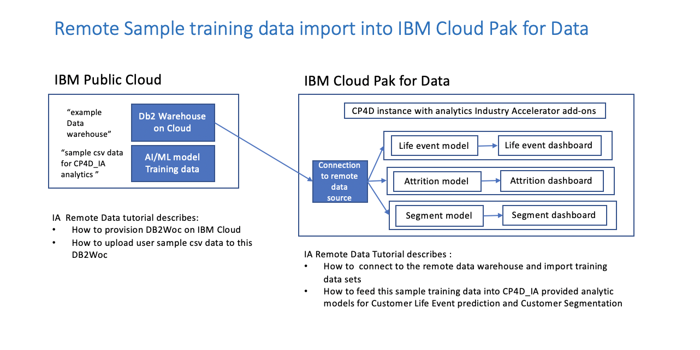
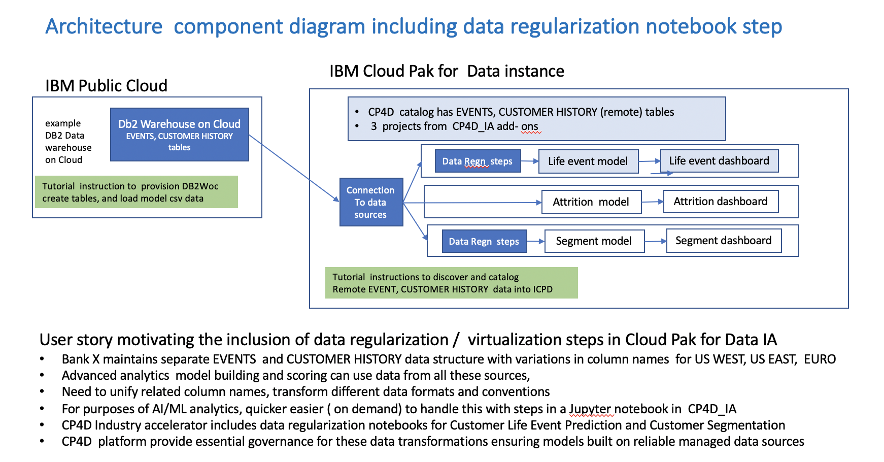
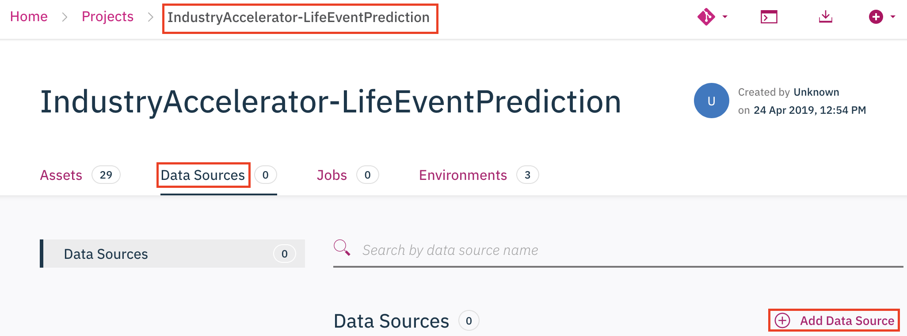
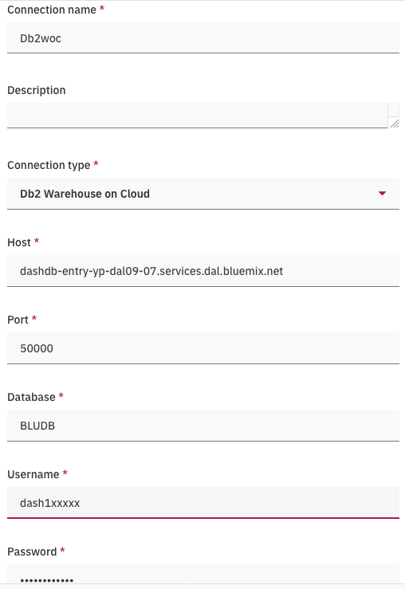
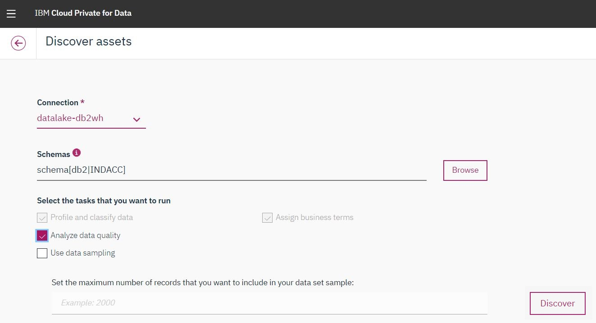
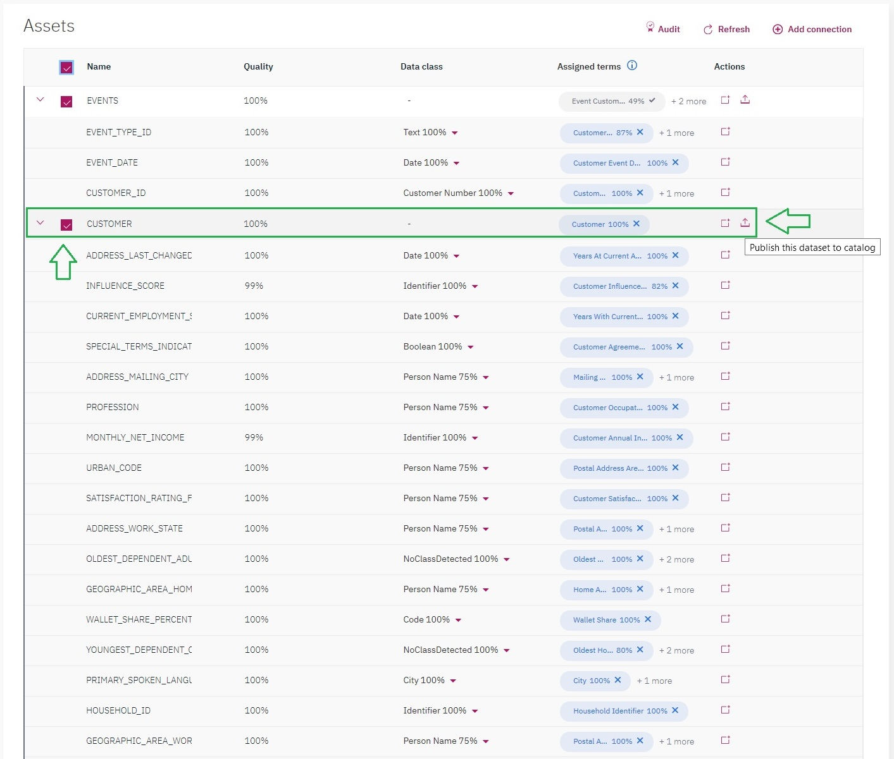
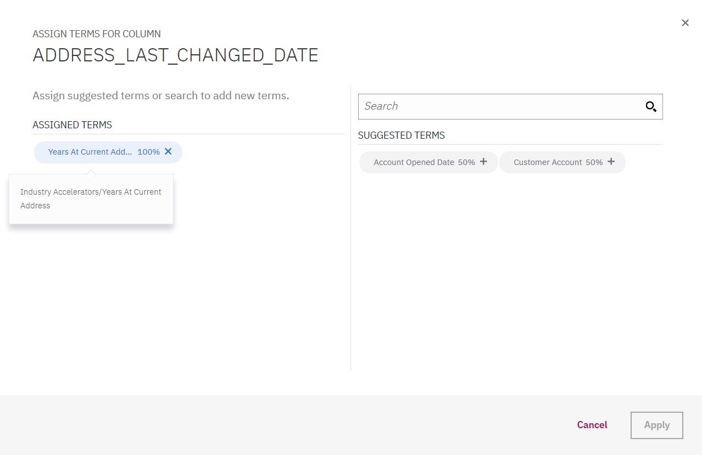
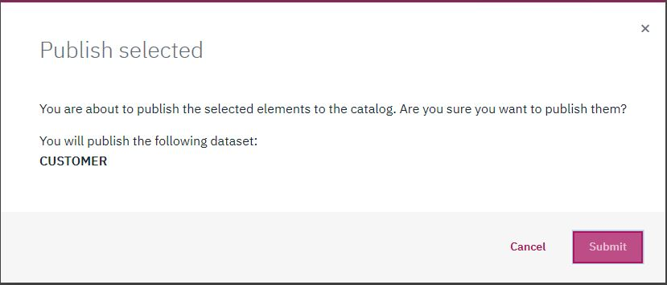
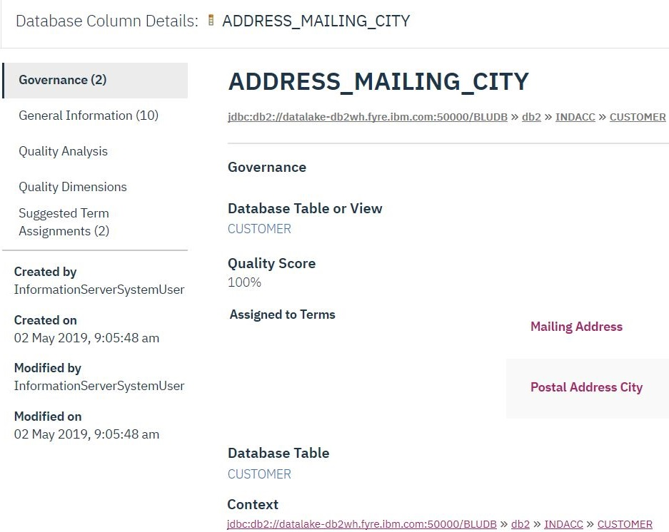
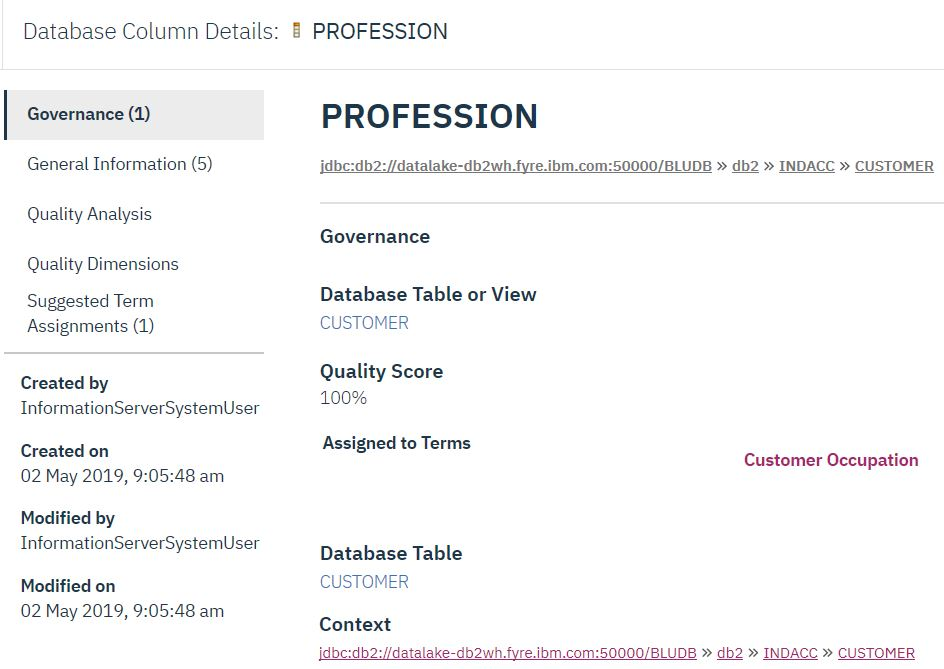

<h1> Cloud Pak for Data Industry Accelerators: Importing and Cataloging Sample Datasets </h1>
<h2> Overview of Tutorial </h2>
This directory contains materials needed for the Remote Data Load Tutorial explaining how to set up and import sample data sets from a remote location for use with the Cloud Pak for Data Industry Accelerator (CP4D_IA) analytic models. 
 
 
The  Artificial Intelligence / Machine Learning (AI/ML) models for Customer Life Event prediction and Customer Segmentation provided as  IBM Cloud Pak for Data Industry Accelerators need to be trained with source data. A local copy of sample source data for training these models is provided with the Industry Accelerator add-ons to Cloud Pak for Data. This tutorial is an optional extension showing how to import training data from a remote source into a Cloud Pak for Data instance and use the imported data to train the model. Any user who wants to explore use of the AI/ML models provided in the Industry Accelerators but wants to import their own data from a remote data warehouse to train and deploy models in Cloud Pak for data can follow the step by instructions in this tutorial to learn how to do this. 

The guidance covers: 
*  Specific steps to create a very simple data warehouse in IBM Public Cloud and populate it with the sample data used to train Custom Life Event Prediction and Customer Segmentation models provided as Cloud Pak for Data Industry Accelerators
*  Step by step guidance on (1) connecting a Cloud Pak for Data instance to this sample data warehouse (2) discovering and importing sample data from the remote data location for use in a Cloud Pak for Data analytics project 
*  Pointers to optional Jupyter notebooks for data reorganization provided as part of the Cloud Pak for Data Life Event Prediction and Customer Segmentation Industry accelerator add-ons; these notebooks handle differences between data schemas used in the remote data warehouse and data organization expected for analytic model training data. 

Working through this tutorial will teach users a set of tools and  techniques for importing remote data, typically from existing enterprise data warehouses and operational busness systems for use in training AI/ML analytic models being developed in Cloud Pak for Data.  The tutorial explains how to use data imported from a remote source to train the AI/ML models provided as Cloud Pak for Data Industry Accelerator add-ons.  

<h2> Using CP4D_IA models with local and remote data - when to use this tutorial </h2>

The user can choose (or progress through) options by selecting one of the choices below.  

<h4> Execute Customer Life Event Prediction model with **local** training data </h4>

*  Install Life events CP4D_IA add-on projects for Customer Life Event Prediction and Customer Segmentation and Custome Attrition
    *  this will also install related terms and glossaries into the CP4D Catalog 
*  Train and deploy the provided AI/ML models using the local  sample csv training data installed with the CP4D_IA add-ons. 

This path works wntirely with local data, no use is made of remote data and additional steps in this tutorial. Guidance on how to train the models with local data is available in the Jupyter notebooks installed as part of the CP4D_IA add-ons.  

<h4> Follow steps in this tutorial to have CP4D_IA models import their training data from a remote location </h4>
This tutorial explains how to set up a remote repository, populate it with sample training data and have this remote data imported into a CP4D instance and used to train CP4D_IA analytic models. 

The steps to do this are: 
 *  Using an IBM public cloud account, provision a DB2 Warehouse on Cloud Instance - the "lite" version can be provisioned on demand, is free and is sufficient to run this CP4D_IA examples. 
 *  Create sample source data tables in this Data Warehouse
 *  read in sample source data in csv files to  populate these tables 
 *  Set up a connection from CP4D to access this remote data 
 *  Have CP4D discover  and import assets accessible via this connection
 *  The  imported datasets can be automatically tagged using  industry specific terms and glossary -  and published in the CP4D catalog with the resulting tags 
 *  Ths imported source data can be used to train and score advanced analytics models for life event prediction and Customer segmentation running in CP4D. 
 *  An initial step of data regularization, data virtualization performed in Jupyter notebook in CP4D is a convenient way to organize incoming information to get best value out of advanced AI/ML analytics executing in CP4D. 
 
The steps to set up a remote data source for CP4D advanced analytics described in the tutorial: 
*  Establishes the pattern for users to connect CP4D models to their own preexisting ( possibly not IBM ) enterprise data warehouses.
*  Users can add their own data into pipeline
*  Automatic tagging of discovered data sets with Banking model terms help organize and locate datasets relevant to Industry specific categories of analytics executing in CP4D. 
*  The tutorial documents use of remote training data with The Customer Life Event Prediction and Customer segmentation models Since the CP4D_IA Customer Attrition model uses the same same schema for training data as for Customer Segmentation, the pattern described in the tutorial canbe reused to have the Customer Attrition model working with remote data also. 

<h2> Architecture and Rationale </h2>

The architecture for remote sample data import is illustrated in the following figure:
 

    
<h3> Rationale </h3>
The benefits of organizing  the sample data import steps in this way include: 

*  Typical environments will already have an existing enterprise data warehouse hosting their data outside of Cloud Pak for Data (CP4D).
*  Provisioning a Db2 Warehouse on Cloud in IBM Public Cloud is a low touch approach to providing access to Cloud Pak for Data Industry Accelerator (CP4D_IA) sample data and metadata.
*  This approach creates a low touch path for a CP4D_IA user to introducde their own sample data and metadata and experiment with processing it using the CP4D_IA advanced analytical models.

  

<h2>  Prerequisites to execute this data load and Cloud Pak for Data import flow </h2>
To work with remote data sourcing for any of the CP4D Industry Accelerators you will need:
  
 * An a user account with **admin** priviledge on a provisioned CP4D instance 
     * Since you will be discovering and importing data assets from a remote source and making them visible in the CP4D catalog to all users of the CP4D instance **admin** priviledge is required.  
 * An account on IBM Public Cloud.
     * This can be a free IBM Cloud account if the CP4D_IA models are being used as a tutorial (ie. not production).  
     
 If you are only executing the advanced analytics examples for Customer Life Event prediction, Customer Attrition and Customer Segmentation add-ons with locally provided csv sample training data (no data import operations), a **Data Scientist**  or **Data Engineer** role account on an CP4D instance is sufficient, since running the analytics locally makes no use of or updates to the CP4D catalog.       
  
<h2>  Overview of steps in the data import into Cloud Pak for Data process</h2>
The sequence of steps required to set up an example data warehouse, install data and then import it into the CP4D catalog can be summarized as follows: 
  
Starting from an IBM Public Cloud account: 
1.   Provision  Db2 Warehouse on Cloud.
2.   Generate and display credentials to this database and open the Db2 Warehouse console.
3.   Add a new table into this warehouse.
4.   Set up csv processing to upload sample data into this table.
5.   Use SQL to validate the sample data and set up more complex partioned event tables (for simple CP4D data virtualization demonstration).
6.   Set up the connection from the CP4D instance allowing discovery and import of data assets from a remote data warehouse.
7.   Request CP4D to discover and import assets from a remode data warehouse using a defined source data connection.
8.   Show data read and data virtualization/regularization steps in a CP4D Jupyter notebook as the first step in advanced analytics.

<h2>  Db2 Warehouse on Cloud Setup and Load Sample Tables </h2>
A useful reference for the Db2 Warehouse on Cloud provisioning and sample table creation is provided in the IBM Public Cloud tutorial:  [SQL Database for Cloud Data](https://cloud.ibm.com/docs/tutorials?topic=solution-tutorials-sql-database#sql-database)
 
We follow the Db2 Warehouse provisioning, table create, and load steps from this tutorial.  After table creation and validation the tutorial goes on to install and then deploy a python application. For our purposes of getting table data and metadata loaded into CP4D, no application is needed.  CP4D is able to connect to the Db2 Warehouse on Cloud directly to discover and import assets.

<h3> Step 1: Create an Instance of Db2 Warehouse on Cloud Service </h3>
  
* Log on to your [IBM Public Cloud account](https://cloud.ibm.com)
    * it is possible to create a free "trial" account if you do not have one.
* Click on  **catalog** in the top navigation bar in the main dashboard
    *  This will open a list of **All Categories** of available service in the left navigation pane 
* Click on  **Databases**  to open a list of available database services
    * from this list select **Db2 Warehouse** as the database service to be provisioned  
* Pick the Entry plan and change the suggested service name to "sqldatabase" (you will use that name later on). Pick a location for the deployment of the database and make sure that the correct organization and space are selected.
* Click on **Create** . After a short moment you should get a success notification.
* After successful Db2 Warehouse on Cloud provisioning, the console will show:  CloudFoundryServices> Db2Warehouse-nn  
    * It should show up in the list with a id Db2Warehouse-nn, where nn is a numeric identifier for the Db2Warehouse on Cloud instance.
    * The state should show as provisioned.   
    
<h3> Step 2:  Generate and display credentials and open the console for this Db2Warehouse on Cloud Service </h3>

You will need to create and keep handy for use in several steps below credentials to access your provisioned DB2Warehouse on Cloud instance.

*  If necessary logon to IBM Public Cloud  to get to the dashboard screen 
*  From the command drop down menue in upper leftcorner,  select **services** for a panel listing the provisioned services 
*  Double click on the Db2 Warehouse on Cloud Service in the services listing.
    * this will bring up the Db2 Warehouse on Cloud main panel.
*  In the left side of this panel select  **Manage Credentials**.
*  If  there is is already a credential created, select it and click on display.
*  If no credential existed previously, you can request new credential creation.
*  The information you will need to save for later use: 
    *   userid - this will be astring typically of the form dash99999   with a nummeric suffix 
    *   password - this is a twelve character string typically with random and special characters 
  
<h3> Step 3: Define and add a new table into the data warehouse </h3>

*  From the (command) menu in the top left corner of the Db2 Warehouse on Cloud console, select  **explore**
    *  This will show a list of schemas already defined in the data warehouse.
*  One of the schemas will be the schema associated with all tables defined for your userid  of the form DASH99999 
    *  where the numeric string will be the suffix for your Db2 warehouse credentials. 
    *  Click on this schema in the list. 
    *  This will bring up a list of any tables already defined in this schema.

    
* Since we want to add a new table, click on **+ New Table**
    
*  We will create a new table in the schema associated with your userid  - this will be shown as schema with name of the form DASH99999 - where the suffix is some numeric string.
    *  This is the userid set up and saved from step 2 of inspecting the data warehouse credentials.
*  Select this schema.

To define a new table we will need the table name and a set of column name column type pairs. This approach can be used to load any csv data into the warehouse. The important case for working with CP4D_IA models is to show how to load the sample training data files into the models for Customer Life Event prediction and Customer Sets.  The sample training data files are available at :
 [IA_sample-data-sets](./datasets)  . 

*  Select  **+ new table**  to start the process of defining a new table name.
*  We can enter a new table name  this will be:
   *  EVENTS if you are setting up to source Customer Life Event Prediction with remote sample EVENT data 
   *  FCH1 if you are setting up to source Customer Segmentation or Customer Segmentation analytics with remote sample full Customer History data   
*  To define the table we need to specify the field names and types for each column in the table we are adding.
    * For the EVENTS sample table, the column definition texts can be  can be copied from [EVENTS definition](event-def.txt) and pasted into the field definition box in the new Table create screen.
    * For the FCH1 full customer history sample table, the column definition text can be copied from [FCH1 definition](fch-def.txt) and pasted into the field definition box in the new Table create screen.
* Click on **create** to create the table 
    * success of the table creation will be should be reported 
    * If you click on the DASH99999 schema in the Explore screen, it should refresh and show show the newly created table in the list of tables defined for the schema
    *  select the table name and it will show the defined columns of the new table 
    *  at this poin the table will have no rows; loading the table with sample data is the next step 

<h3> Step 4: Setup transform and import to load sample data into the newly created table </h3>
The next step is to load the newly created table, either EVENTS or FCH1 ( in the Db2 warehouse on Cloud) with sample data available from a connected workstation or other source.  Here we describe the specific steps to load data from a csv sample source file:

* for life event prediction  analytics, sample data source is [event.csv](./datasets/event.csv) 
* for customer segmentation and customer segmentation analytics, sample data source is [full_customer_history.csv](./datasets/customer_full_summary_latest.csv) 
These two sets data sets can be downloaded from this tutorial. If the coresponding CP4D_IA add ons have been installed, the same sample data is available in the Analytics project data directories for the IAs. Find this data by opening a CP4D console window in the Add-on projects and navigate using the file tab in the console display.  

After this source data setup in steps 6 - 8 in the demo/tutorial we will describe how to discover and read from this remote data asset in CP4D and use the resulting data to train and deploy a scoring service for these AI/ ML Models in CP4D_IA.  

This provides a *pattern* for how to get an CP4D_IA advanced analytics model to read and use remote data a common situation when CP4D is used to provide scalable analytics using data from an existing Enterprise Data warehouse. 

<h4> Steps to load sample data into new table </h4> 

* In the Db2 Warehouse on Cloud console, from the command pulldown menu in the upper left title bar, select **LOAD**
   *  This will bring up the identify source data panel 
*  The **browse files** option allows selection of the data source from file in the workstation connected to the DB2 Warehouse on Cloud console 
   *  The source file should be sample csv data matching the format defined for the Target table 
   *  events.csv  to populate EVENTS table, full_customer_history.csv to populate FCH1
   *  *Note: you may need to have down loaded these tables to your workstation from ICPD For Data* ; 
   *  They are available in a datasets folder as part of the project where you have imported the correspoding CP4D_IA addon 
   *  The default option (in the identify source files) that the source file is NOT originating in a PureData System for Analytics will be correct unless you are using an IBM Neteeza source system
* Click the **next**  button to at bottom right to bring up the identify target panel 
   *  Select your working schema from the list of schemas 
   *  This is likely to be a userid schema for your username into the Db2Woc instance of the form DASH999999
*  Select the target table name - in this case we want to load sample data into:
   *  an EVENTS table for the LIfe event Prediction analytics
   *  an FCH1 table if you are setting up remote data for the Customer Segmentation analytics 
   *  The column definitions for that table will be displayed 
* Click the **Next** button to bring up the transforms definition panel 
   *  This panel provides opportunities to correct any issues with csv formats in importing fields into the taget EVENTS table 
   *  There are option to select:  header line yes/no, separator char etc 
   *  In events.csv there is header line naming the columns - hence this option should be selected 
   *  The field separator should be set to "," for both events.csv and full_customer_history.csv  
   *  With transform steps identified select **Next** to see the load confirmation screen summarizing the action 
* this includes an option whether to append the new data to any existing data on the table or to overwrite existing data 
   * In the case that the target table is empty, this choice will have no effect 
* Click on **Begin Load** to start loading the data 
   * Depending on the size of sample data set you are loading this operation may take some time - possibly minutes
   * Any load warnings will be shown on the console screen 
   * When the operation completes, the  source sample data will be loaded into the target table  
   * the provided sample data has about 100,000 events to load into EVENTS and 1000 customer history records to load into FCH1
 
 <h3> Step 5: Use console and SQL to validate loaded data and setup tables for CP4D data restructuring demonstration </h3>
 
A simple level of validation of the loaded data into the EVENTS table can be done using the Db2 Warehouse on Cloud **EXPLORE** command.
* in the Db2 Warehouse on Cloud console, select **EXPLORE*
* select the schema which corresponds to your userid - a name of the form DASH99999 
   * the numeric suffix in this schema is specific to your Db2 Warehouse on Cloud  userid 
*  select the EVENTS table within this schema 
* click on the **View Data** button
 
This will display data records currently loaded in the EVENTS table, permitting an initial level of validation of the loaded data. 

Deeper analysis and manipulation of the Db2Woc table data is possible using the console **RUN SQL** command from the drop down at the left of the title bar. 

The Run SQL panel provides a scratchpad for pasting and editing SQL commands for query manipulating or creating tables. Specific SQL commands in this scratchpad can be selected and then executed using the **Run** and **Run Selected** options. The results are displayed in a result area in the lower part of the panel. 
For example
*  typing "SELECT COUNT(\*) FROM EVENTS" into the scratchpad 
*  selecting this line - it becomes highlighted 
*  Clicking **Run SQL** then **Run Selected** will show:
   *  in the lower left panel, success o parsing the command 
   *  in the lower right panel, success of executing and the result returned from the command.

Next we describe how to use this RUN SQL capability to automate setting up a  more complex set of *regional*  EVENT tables used in the CP4D IA remote data import.  

The motivating context for this is illustrated in the diagram below. 

The file [bankXeventsSQL.txt](bankXeventsSQL.txt)  is an SQL script to set up "Regional" EVENTS tables and partition the data in the single initial EVENTS table across these by allocating each customer id to a specific region.  Similarly the SQL script file [bankXCustHistSQL.txt](bankXCustHistSQL.txt) creats regional full Customer History tables and populates them with data from the base FCH1 table.

The regions are:
* US WEST 
* US EAST 
* EUROPE

Tables EVENTS_USW, EVENTS_USE,EVENTS_EUR are created for regional EVENTS, and similarly FCH_USW, FCH_USE<FCH_EUR created for customer histories. In both cases, each Customer_ID is assigned to a particular region and all records for that customer copied into the appropriate regional table 

These SQL script files can be copied and pasted into the scratchpad aread of the **Run SQL** panel, selected and executed.
The effect will be to initialize  regional tables for EVENTS or CUSTOMER HISTORIES. This represents a typical situation in a remote source data warehouse, with data organized to match operational business needs of different organizations in the enterprise. 

We will use these regional table structures to show a simple data virtualization / date regularization front end executing in CP4D in a Jupyter notebook in order to assemble a large training set for a AI/ML analytics models. Since we do this for both events and  customer History data, the life event prediction and customer segmentation analytics are each covered. Since Customer Attrition analytics also is sourced entirely from customer history data, the same data regularization/virtualization pattern could be applied in that case also by copying over the 1-load-data Jupyter notebook from the Customer Segmentation add-on project into the Customer Attrition add-on project.  

<h3> Step 6: Set up the CP4D connection allowing discovery and import of remote data assets </h3>
A feature of CP4D is that  connections can be defined to access sources of data assets as remode services and data warehouses.  We next describe the detailed steps to set up an ICPD connection to the Db2 Warehouse on cloud instance we have establish in the preceding steps of this tutorial.  These steps assume that you have set up a project within CP4D, specifically the "Customer Life Event Prediction" Industry Accelerator.

*  Logon to your ICPD instance and open the _"Life Event Prediction"_ project.
*  __Add Data Source.__  From your project, select __Data Sources__ and __Add Data Source.__

* __Add Connection.__  Next, you will add a connection by selecting __"Add Connection"__ and then filling out the form with the required information obtained when the remote database was created. For this example, use a connection name of "Db2woc" and a type of "Db2 Warehouse on Cloud". Make sure you select __"Test Connection"__ to check that everything has been configured properly and then select __"Add"__.
 

You also need to enter a user name and a password field for the source connection. 
These can be pulled from the credential providing access to the Db2 WOc Server you have provisioned in steps above.
I
There was a detailed description in Step 2 of this guide  how to display the Db2 Credential contents. 

*  The credential includes a "*username*" field with a value of the form "dash99999"; copy and paste this into the *usename* field in ICPD **Add connection** panel. 
*  It also includes  a "*password*" field whose value will be a string; this should be copied and pasted into the corresponding ICPD **Add connection** field 

If you are connecting CP4D to some other  preexisting Data warehouse you will need to know its ipaddress, port on which it listens for connection requests, database name and valid userod and password values.  You need to enter this information into cirresponding fields in the CP4D **Add connection** panel. 

With these fields completed the **Test connection**  button at the bottom right side of the CP4D  **Add connection**  panel will be enabled.

Use this for CP4D to perform a level of connection validation. If this succeeds, the **Add** button is enabled. Use this to add the new connection to the list of connections available in CP4D. 

---

---

---

<h3> Step 7: Request CP4D to discover and import assets on a source data connection </h3>
In this step you request CP4D to discover available data assets in one or more named schemas accessible through a specified data connection, import the data, and catalog it in the CP4D catalog. In the process the discovered assets will be automatically categorized and tagged using glossary terms which have been imported into the CP4D catalog as part of the Industry Accelerator install. 

Steps:
*  Open the CP4D asset discovery window to set up the discovery path.
   *   In the drop down command menu in top left corner of CP4D dashboard title bar.
   *   Select **Organize**.
   *   Select **Discover assets**.
*   The **Discover assets**  panel requires you to select from a list of connections:
   *   This connection list is a subset of all defined ICPD data connections.
   *   It includes connection of category Db2 or relational data.
   *   It may not include connections on which asset discovery has already been performed.
*  You are prompted to enter a specific schema name within the data resource identified by the connection.
   *  This will restrict data discovery to that schema only 
* Use the **browse** button to get a list of available schemas on the connection.
   *   Select the schema on which to perform asset discovery.
   *   It may be permissable to select the database name rather than a specific schema with it and discover on all schemas (for which this username/password is authorized).
 
Additional options are available for selection to govern what processing is performed during data discovery and import:  
*   Profile and classify data 
*   Assign business terms 
*   Analyze data quality 

Make sure both the **Assign business terms** and the **Analyze data quality** tasks are selected.  
  

  
This will look for column names matching glossary business terms in the Catalog and cause the metadat of the imported datasets in the Catalof to be associated with these terms - making them easier ti locate in the ICPD catalog when a given analytics / modelling effort begins. The automatic assignment of terms to dataset columns also utilizes the predefined mappings that were imported to Catalog with the Industry Accelerator. 

At this point the **discover** button  at bottom right of the **Discover assets** panel will be enabled.  Click on this button. 
There will be a warning that data discovery and import may take time, then the process will start. 

After  successful import of the data: 
   *  CP4D reports successful import 
   *  imported tables from the remote schema are now visible in the CP4D catalog  
   *  columns from the imported tables have been automatically associated with Industry glossary terms in the ICPD catalog
   *  if the columns names of the imported tables match exactly those from the sample datasets provided in Industry Accelerator then all of the business glossary terms assigments provided with the Industry Accelerator are replicated for the imported datasets columns
  
<h4>CLoud Pak for Data reports successful import </h4>
  

   

<h4>Details of the asset discovery results </h4>
  

   

<h4>Review of the suggested terms with option to assign additional terms </h4>
  

   

<h4>Confirm publishing of selected dataset information and term assignments into Catalog </h4>
  

   

<h4>Examples of the column to term assignment in Catalog </h4>
  

 

   

<h2> Introduction: User options within this tutorial </h2>

The user can choose (or progress through) options, incrementally providing more ICPD insight – more complete “end-to-end” pattern
by selecting one the choices below. 

<h4> Execute Customer Life Event Prediction model with provided sample data </h4>

*  Install Life events CP4D_IA add-on projects for Customer Life Event Prediction and Customer Segmentation
    *  this will also install relate terms and glossaies into the CP4D Catalog 
*  Execute model using provided sample csv data in project ; view dashboards

<h4> Follow tutorial steps to set up a remote repository sample source data importe and used by ICPD analytics </h4>

 *  Using an IBM public cloud account, provision a DB2 Warehouse on Cloud Instance - the "lite" version can be provisioned on demand, is free ad is sufficient to run this CP4D_IA examples. 
 *  Create sample source data tables in this Data Warehouse
 *  read in sample source data in csv files to  populate these tables 
 *  Set up a connection from CP4D to access this remote data 
 *  Have CP4D discover  and import assets accessible via this connection
 *  The  imported datasets can be automatically tagged using  industry specific terms and glossary -  and published in the CP4D catalog with the resulting tags 
 *  Ths imported source data can be used to train and score advanced analytics modes for life event prediction, Customer segmentation and customer shurn running in CP4D. 
 *  An initial step of data regularization, data virtualization performed in Jupyter notebook in CP4D is a convenient way to organize incoming information to get best value out of advanced AI/ML analytics executing in CP4D. 
 
This second option - setting up a remote data source for the remote CP4D advanced analytics: 
*  Clearly establishes the pattern for user to connect CP4D models to their own preexisting ( possibly not IBM ) enterprise data warehouses.
*  User can add their own data into pipeline
*  Automatic tagging of discovered data sets with Banking model terms help organize and locate datasets relevant to Industry specific ctegories of analytics executing in CP4D. 
*  Since The CP4D_IA for Customer Attrition uses the same same schema for training data as CP4D_IA for Customer Segmentation, the interested user can set up data import and a Jupyter notebook for reorganizing anf feeding remote sampe training data into that analytic mode aslo patterned on the data reorganizatin notebook provided with the Customer Segmentation Industry Accelerator add-on.
